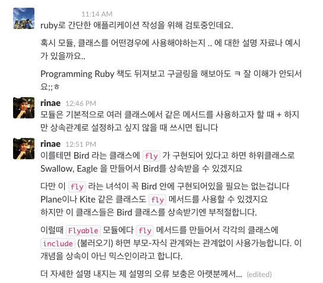

- **이 포스팅은 [Luca Guidi의 포스팅](https://lucaguidi.com/2016/06/07/the-penguin-that-cannot-fly.html)을 번역한 글입니다**
- **오역이나 잘못된 표현 지적은 언제나 환영합니다**

---

## 객체 지향 프로그래밍, 인터페이스, 동적 타입에 대한 짧은 이야기

*역주: 이 글은 가상의 이야기를 기반으로 객체 지향의 개념을 일부 짚어주는 글입니다 '루비 3'는 아직 개발 중이며, 어떤 형태로 나오게 될 지 모릅니다.*

오늘은 주식회사 활빈당(Spectacular Foo Ltd. *역주: 보통 임의의 사람 이름을 홍길동이라고 하다 보니 임의의 회사 이름은 무엇으로 할까 하다가...*)의 본사에서 일어나는 일을 이야기해보고자 한다. 이 회사는 인디 게임계에서 떠오르고 있는 회사이고, 다음 블록버스터 타이틀인 *흔해빠진 새들(Banal Birds)* 의 발매를 앞두고 있다.

올해는 2019년이고, 루비 3는 세배나 빠르고, 놀랍게도 모든 문제를 해결할 수 있는 동적 타입을 가지고 있다! 조금 향수에 젖은 결정이긴 하지만 당신은 리드 개발자로서 루비를 이 프로젝트에 사용하기로 결정했다.

당신은 관리자인 제인에게 최종 코드 리뷰를 부탁했다.

```ruby
class Game
  def initialize(bird: Bird)
    @bird = bird
  end

  def play
    @bird.fly
  end
end
```

아이디어는 간단하지만 혁명적이었다: 플레이어는 **어떤** 종류의 새라도 고를 수 있고 그 새가 날아가는 것을 볼 수 있다. 이건 엄청날거야!(This is gonna be kickass!)

당신은 유명한 루비 젬 `acts_as_a_bird`(새처럼 행동하라)를 재사용했다. 이 젬은 `Bird` 를 완벽하게 구현하였다.

```ruby
class Bird
end
```

많은 새들 가운데서 우리는 올빼미나 벌새도 구현했다:

```ruby
class Owl < Bird
  def fly
    puts "I'm a flying owl"
  end
end

class Hummingbird < Bird
  def fly
    puts "I'm a flying hummingbird"
  end
end
```

소프트웨어 공학의 참으로 놀라운 부분 아닌가? 글쎄, 이 게임에 엄청난 투자를 했음에도 불구하고 문제가 하나 남아있었다: 제인이 '그러면 펭귄은요?' 라고 물었다. 그렇다, 펭귄은 새지만 날 수 없다.

```ruby
class Penguin < Bird
  # LOL I'm a penguin (ㅋㅋㅋ 난 펭귄인데?)
end
```

오늘은 게임 발매 당일이고 당신은 버그를 수정하기 위한 여력이 없다. 그래도 발매는 되어야 한다(The show must go on). 그래서 당신은 게임을 발매하고 사용자들이 펭귄을 고르지 않기를 기도할 수 밖에 없다.

당신은 기분이 별로다. 그리고 자기 자신에게 묻기 시작한다: *왜 내가 루비를 골랐지? 왜 동적 타입을 쓴걸까?*

제인은 "당신이 정말 사용해야 했던 것은 타입이 아니라 인터페이스에요." 라고 말했다. 당신은 그 말을 듣자마자 "맙소사, 자바 말인가요!?(OMG, Java!)"  라고 말했지만, 그녀는 찬찬히 시간을 들여 그 개념은 [Go(GoLang)](http://golangtutorials.blogspot.kr/2011/06/interfaces-in-go.html)에서 빌려온 것이라고 설명하였다.

> "루비같이 동적 타입을 가지고 있는 언어에서, 당신이 정말 신경써야 하는 것은 **행동(behavior)**이에요. 당신은 객체에 *메세지를 보낼 수 있도록* 해야합니다. 그게 객체 지향 프로그래밍의 핵심이에요."

그녀는 계속 설명했다: "타입을 사용하는 것은, 당신이 수행하고자 하는 일보다 과하게 많은 일을 수행하려는 객체를 받아들인다는 것과 같아요. 그리고 그건 [인터페이스 분리 원칙](https://ko.wikipedia.org/wiki/%EC%9D%B8%ED%84%B0%ED%8E%98%EC%9D%B4%EC%8A%A4_%EB%B6%84%EB%A6%AC_%EC%9B%90%EC%B9%99)을 무너뜨립니다."

> "차이점은 미묘해요: 당신은 `Bird` 클래스가 `fly` 메서드에 반응할 것이라(respond to) 추측했지요. 하지만 언제나 그렇진 않아요. 대신 프로그래밍 언어 측에서*(역주: 문맥 상 프로그래머가 작성한 코드를 말하는 것으로 보입니다)* 주어진 객체가 특정 메서드(혹은 메서드의 모음)를 구현하고 있는 지 확인하는 도구를 제공해야 합니다."

이 시점에서 당신은 충격을 받았다. 당신은 루비가 행동의 모음을 정의할 수 있는 특별한 모듈을 제공했으면 정말 좋겠다고 생각했다*(역주: wished라는 동사를 사용했지만 문맥상 희망하다라고 쓰기엔 딱딱해 보입니다)*.

```ruby
interface Flying
  def fly
    puts "I'm a flying #{ name }"
  end

  def name
    "bird"
  end
end

class Falcon
  include Flying

  def name
    "falcon"
  end
end

class Game
  def initialize(bird: Flying)
    @bird = bird
  end

  def play
    @bird.fly
  end
end
```

또한 가상머신(VM)이 '펭귄은 날 수 없다' 같은 당황스러운 에러를 내뿜기 전에 당신을 막아주었으면 좋겠다고 생각했다. 

---

## 번역 후기

예전에 RORLAB 슬랙의 질문 채널에서 이런 내용의 대화를 주고받은 적이 있습니다.



마침 이 글을 읽은 직후라 비유를 `fly` 로 사용했었던 것이 기억나네요. 보통 동적 타입을 사용하는 언어들의 단점으로 여러가지가 거론되지만 '실행하기 전에는 무슨 일이 일어날 지 바로 알 수 없다' 라는 단점을 본 적이 있습니다.

하지만 본문에서 설명한 개념으로 그런 단점을 최소화하는게 가능하겠지요. 핵심은 프로그래머가 자신의 프로그램이 어떻게 동작할지를 면밀하게 설계할 필요가 있다는 것입니다.

위 개념을 조금 더 적극적으로 활용하고자 하시는 루비 프로그래머분들은 [루비로 배우는 객체지향 디자인](http://www.aladin.co.kr/shop/wproduct.aspx?ItemId=49317754)의 5, 6, 7장을 찬찬히 살펴보시면 많은 도움이 될 것입니다.

2016년의 마지막 날, 이 글을 읽는 분들에게 조그마한 새해 선물이 되었이 되었으면 좋곘고 새해에도 많은 분들과 더 좋은 내용의 글을 주고받을 수 있도록 개발자로서의 역량을 갈고 닦고 싶습니다 :)