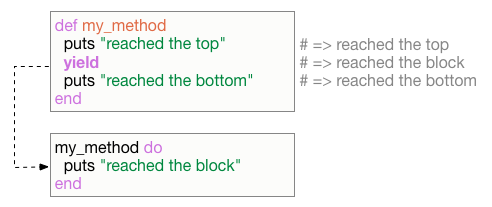

- **이 포스팅은 [Cezar Halmagean](https://twitter.com/chalmagean)의 [포스팅](https://mixandgo.com/blog/mastering-ruby-blocks-in-less-than-5-minutes)을 번역한 글입니다**
- **번역 내용에 대한 조언 및 의견은 언제나 작성자에게 큰 도움이 됩니다**

---

블록은 루비에서 가장 강력한 기능이지만 대수롭지 않게 여겨지는 기능이기도 합니다. 고백컨데 저도 루비 블록이 어떻게 동작하는지, 그리고 실제로 어떻게 유용하게 사용될 수 있는지 알아내는데 시간이 좀 걸렸습니다.

처음에 블록을 이해하는데 굉장히 어렵게 만드는 요소로 `yield` 등의 개념이 있습니다. 저는 블록의 일부 개념에 대해 이야기하고 몇몇 예시를 들어서 글 마지막에는 여러분이 루비 블록을 명확하게 이해하도록 돕겠습니다.


## 무엇을 배울 것인가

1. 기초: 루비 블록이란?

2. `yield` 가 동작하는 방법

   - 블록을 메서드로 전달하기
   - `yield` 도 매개변수를 받는다

3. `&block` 은 무엇을 의미하는가?

4. 값의 반환

5. `.map(&:something)` 은 어떻게 동작하는가?

6. 반복자, 그리고 여러분의 반복자를 직접 만들기

7. 블록을 이용하여 기본값으로 객체를 초기화하기

8. 루비 블록 예시

   ​


## 기초: 루비 블록이란?

블록은 기본적으로 `do` 와 `end` 사이에 들어가는 코드입니다. 그게 다에요. *"그럼 마법같은 일(Magic)은 어디서 일어나는거죠?"* 라고 질문하실 수 있겠습니다. 우리는 몇 분 이내에 그 부분을 파고들겠지만 차례대로 설명하겠습니다(but first things first).

여러분은 블록을 두 가지 방법으로 작성할 수 있습니다. 1. 멀티-라인으로 작성할 때는 `do` 와 `end` 사이에 코드를 작성하고, 2. 인라인으로 작성할 땐 `{` 와 `}` 사이에 코드를 작성하면 됩니다.

이 두 가지 작성 방법은 정확하게 똑같이 작동합니다. 그래서 어느 방법을 고를 지는 여러분의 선택에 달려 있습니다. 일반적인 스타일 가이드에 의하면 가독성을 위해 코드가 한줄 이상 넘어가면 `do` ~ `end` 를 이용하여 작성하는 것이 좋습니다.

멀티 라인 블록의 기본적인 예시는 이렇습니다: `[1, 2, 3].each do |n| puts "Number #{n}" end`

이 블록이 멀티 라인 블록이라 불리는 이유는 한 줄 이상으로 코드가 작성되어서가 아니고 인라인 블록이 아니기 때문입니다. 같은 예시를 인라인으로 작성할 수도 있습니다.

```ruby
[1, 2, 3].each { |n| puts "Number #{n}" }
```

두 가지 버전 모두 1, 2, 3을 순서대로 출력할 겁니다. 파이프 사이에 있는 소문자 n(`|n|`)은 **블록 매개변수(block parameter)** 라고 불리고, 이 예시에서는 배열 안에 있는 각각의 번호가 순서대로 나오게됩니다. 그래서 처음 반복 시에 `n` 의 값은 1이 되고, 두번째 반복에서는 2가 되고 그 다음엔 3이 됩니다.

```
# 결과
Number 1
Number 2
Number 3
 => [1, 2, 3]
```


## yield가 동작하는 방법

이제 위험한 녀석이 왔습니다(Here's bad wolf). 이 녀석이 루비 블록의 마법스러움과 혼란스러움을 가져다주는 주범이지요. 제 생각엔 대부분 `yield` 가 블록을 호출하는 방법과 어떻게 매개변수를 전달하는지가 어렵게 보일 것이라 생각합니다. 우리는 이 섹션에서 두 가지 시나리오를 모두 살펴볼겁니다.

```ruby
def my_method
  puts "reached the top"
  yield
  puts "reached the bottom"
end

my_method do
  puts "reached yield"
end
```


```
# 결과
reached the top
reached yield
reached the bottom
 => nil
```

기본적으로 `my_method` 메서드가 실행되고 `yield` 를 호출하는 줄에 도달하면, 블록 안에 있는 코드가 실행됩니다. 그리고 블록 안의 코드가 끝나면 `my_method` 메서드가 계속 실행됩니다.



### 블록을 메서드로 전달하기
블록을 매개변수로 받기 위해 메서드에 특별히 무언가를 정의할 필요는 없습니다. 그냥 블록을 함수(메서드)로 전달할 수 있습니다. 하지만 그 함수가 `yield` 를 호출하지 않으면 블록은 실행되지 않을겁니다.

반면에 메서드에 `yield` 를 호출하도록 해놓으면 블록을 인자로 전달하는 것이 강제됩니다. 이 메서드가 블록을 매개변수로 받지 않는다면 에러가 발생하게 됩니다.

만약 블록을 매개변수로 받는 것을 가변적으로 처리하고 싶다면 `block_given?` 메서드를 사용할 수 있습니다. 이 메서드는 블록이 메서드로 전달되었는지를 따져 true나 false를 리턴합니다.

### `yield` 도 매개변수를 받는다

어떠한 매개변수든지  `yield` 로 전달되면 블록의 매개변수처럼 동작할 것입니다. 그래서 블록이 실행될 때 원래 메서드로(yield를 호출하는 메서드)부터 전달되는 매개변수를 사용할 수 있습니다. 즉 매개변수는 `yield` 가 자리잡고 있는 메서드의 지역 변수가 될 수도 있다는 뜻입니다.

전달되는 매개변수의 순서는 중요합니다. 왜냐면 여러분이 전달하는 매개변수의 순서가 블록이 매개변수를 전달받는 순서와 일치하기 때문입니다.


한가지 유의하셔야 할 점은 블록 안의 매개변수는 블록에만 한정된 지역 변수가 된다는 겁니다. (메서드에 있던 지역 변수를 블록으로 전달할 때와는 다릅니다)


## &block은 무엇을 의미하는가? (ampersand parameter)

여러분은 아마 다른 루비 코드 여기저기에 `&block` 이 사용된 것을 보셨을 겁니다. 이 것은 지역 변수 대신에 블록에 대한 참조(reference) 자체를 메서드로 전달하는 방식입니다. 사실 **루비는 블록처럼 작동하는 어떠한 객체라도 메서드에 전달되는걸 허용합니다.** 메서드가 전달받은 객체가 블록이라면 이 블록을 사용하려 할 것이지만, *만약 블록이 아니라면 그 객체에 `to_proc` 메서드를 호출하여* 블록으로 변환하려고 시도할 것입니다.

또 참고하셔야 할 점은 `block` 이라는 이름은(ampersend(&) 기호 이외의 부분) 단지 참조를 위한 이름일 뿐입니다. 여러분이 좋아하는 어떠한 이름이라도 사용하실 수 있습니다.

```ruby
def my_method(&block)
  puts block
  block.call
end

my_method { puts "Hello!" }
```


```
# 결과
#<Proc:0x0000010124e5a8@tmp/example.rb:6>
Hello!
```

위의 예를 보시다시피, `my_method` 안에 있는 `block` 변수는 블록의 참조이고, 이 블록은 `call` 메서드를 통해 실행될 수 있습니다. 블록에 `call` 을 하는 것은 `yield` 와 똑같은 겁니다. 일부 사람들은 가독성을 위해 `yield` 대신에 `block.call` 을 사용합니다.


## 값의 반환

`yield` 는 블록 안에서 마지막으로 평가된 값(last evaluated expression)이 반환됩니다. 달리 말하면 `yield` 가 리턴하는 값은 블록이 리턴하는 값이라는 겁니다.

```ruby
def my_method
  value = yield
  puts "value is: #{value}"
end

my_method do
  2
end
```


```
# 결과
value is 2
=> nil
```


## .map(&:something)은 어떻게 동작하는가?

여러분은 아마 `.map(&:capitalize)` 같은 단축 표현을 많이 쓰셨을 겁니다. 특히 레일즈로 코딩을 좀 해보셨다면 말이죠.  `.map { |title| title.capitalize }` 에 비하면 아주 깔끔한 단축 표현입니다.

**그런데 이게 어떻게 작동하는걸까요?**

실제로는 [심볼 클래스가](http://ruby-doc.org/core-2.2.0/Symbol.html#method-i-to_proc) `to_proc` 을 메서드를 구현하고 있기 때문에, 단축 표현을 풀어서 실제의 긴 표현식으로 변환해주는 겁니다. 멋지죠?


## 반복자, 그리고 여러분의 반복자를 직접 만들기

여러분은 메서드 안에 있는 `yield` 를 원하시는 대로 몇번이든 부를 수 있습니다. 그게 기본적으로 반복자(iterator)가 동작하는 원리입니다. `yield` 를 배열 안에 있는 각 요소마다 호출하면 루비에서 기본적으로 제공하는 반복자를 흉내낼 수 있습니다.

루비의 `map` 메서드와 비슷한 메서드를 작성하는 방법을 보여드리겠습니다.

```ruby
def my_map(array)
  new_array = []

  for element in array
    new_array.push yield element
  end

  new_array
end

my_map([1, 2, 3]) do |number|
  number * 2
end
```


```
# 결과
[2, 4, 6]
```


## 블록을 이용하여 객체를 기본값과 함께 초기화하기

루비 블록을 사용할 수 있는 멋진 패턴 중 하나는 객체를 기본값과 함께 초기화하는 것입니다. 한번이라도 아무 루비 젬에서나 `.gemspec` 파일을 살펴보았을 때 이 패턴을 보셨을겁니다.

작동하는 원리는 이렇습니다. `initialize` 메서드 안에 `yield(self)` 를 호출하는 초기화 도구(initializer)를 넣어두는 겁니다. 여기서 `self` 는 초기화되는 객체 자신입니다.

```ruby
class Car
  attr_accessor :color, :doors

  def initialize
    yield(self)
  end
end

car = Car.new do |c|
  c.color = "red"
  c.doors = 4
end

puts "My car's color is #{car.color} and it's got #{car.doors} doors."
```


```
# 결과
My car's color is Red and it's got 4 doors.
```


## 루비 블록 예시

요즘은 예시로 보여주는게 대세(all the rage these days)인만큼 실제 세계에서(혹은 실제 세계와 최대한 가까운) 블록을 사용하는 몇가지 흥미로운 시나리오를 보여드리겠습니다.

### 텍스트를 HTML 태그로 감싸기

여러분이 다양한 코드 덩어리를 약간의 고정된 코드로 감싸고자 할 때 블록은 최고의 도구입니다. 예를 들자면 여러분이 어떤 텍스트를 감싸고 있는 HTML 태그를 만들고자 한다면, 텍스트는 가변적이고(왜냐면 아직 당신은 무엇을 태그로 감쌀지 전혀 모르니까요) 태그는 고정적인 부분입니다. 이 형태는 변하지 않습니다.

```ruby
def wrap_in_h1
  "<h1>#{yield}</h1>"
end

wrap_in_h1 { "Here's my heading" }

# => "<h1>Here's my heading</h1>"

wrap_in_h1 { "Ha" * 3 }

# => "<h1>HaHaHa</h1>"
```

메서드에 블록을 넘기는 방법은 여러분이 특정 행동을 재사용하고 싶지만 살짝 다르게 쓰고 싶을 때 유용하다는 점을 알아두시기 바랍니다. 이번엔 우리가 HTML 태그로 감싸고 싶은 문자열이 있고, 이걸 조금 다른 용도로 사용하는 경우를 봅시다.

```ruby
def wrap_in_tags(tag, text)
  html = "<#{tag}>#{text}</#{tag}>"
  yield html
end

wrap_in_tags("title", "Hello") { |html| Mailer.send(html) }
wrap_in_tags("title", "Hello") { |html| Page.create(:body => html) }
```

첫 번째 경우에는 `<title>Hello</title>` 이라는 문자열을 이메일로 보냈고, 두 번째 경우에는 `Page`  레코드를 만듭니다. 두 경우 모두 같은 메서드를 사용했지만 다른 일을 했습니다.

### 노트 작성하기

우리가 생각(아이디어)을 데이터베이스 테이블로 저장하는 방법을 빠르게 개발한다고 생각해보겠습니다. 이 도구가 바르게 작동하려면 우리는 노트의 내용을 전달하고 메서드가 데이터베이스 연결을 다루도록 해야 합니다. 이상적으로 우리는 `Note.create { "Nice day today" }` 라고 호출하고 나면 데이터베이스 연결을 열고 닫는데 일일이 신경 쓰고 싶지 않을 것입니다. 그럼 한번 보시죠.

```ruby
class Note
  attr_accessor :note

  def initialize(note=nil)
    @note = note
    puts "@note is #{@note}"
  end

  def self.create
    self.connect
    note = new(yield)
    note.write
    self.disconnect
  end

  def write
    puts "Writing \"#{@note}\" to the database."
  end

private

  def self.connect
    puts "Connecting to the database..."
  end

  def self.disconnect
    puts "Disconnecting from the database..."
  end
end

Note.create { "Foo" }
```


```
# 결과
Connecting to the database...
@note is Foo
Writing "Foo" to the database.
Disconnecting from the database...
```

데이터베이스 연결, 노트 작성, 그리고 연결을 종료하는 기능의 구체적인 구현은 이 글에서 다루는 범위를 넘어가는 것이라 설명하지 않겠습니다.

### 배열에서 나눌 수 있는(divisible) 요소를 찾기

제가 점점 "실제 시나리오" 와 멀어진 설명을 하고 있는 것 같습니다만, 마지막 예시를 보여드리도록 하겠습니다. 만약 배열 안에 있는 모든 요소 중에서 3으로 나뉘는 요소를 가져온다고 할 때(어떤 숫자를 생각하셔도 상관없습니다), 루비 블록을 어떻게 활용할 수 있을까요?

```ruby
class Fixnum
  def to_proc
    Proc.new do |obj, *args|
      obj % self == 0
    end
  end
end

numbers = [1, 2, 3, 4, 5, 6, 7, 8, 9, 10].select(&3)
puts numbers
```


```
# 결과
3
6
9
```

역주: 위의 코드를 간략하게 설명하자면, 글 위에 `&block` 을 설명한 부분에서 `&` 기호 뒤에 붙어있는 객체가 블록이 아니라면 `to_proc` 으로 블록으로 변환하는 것을 시도한다는 내용이 있습니다. 그래서 [몽키 패칭](https://en.wikipedia.org/wiki/Monkey_patch)으로 `Fixnum` 클래스에 `to_proc` 메서드를 정의해 두는 겁니다. 3이라는 숫자는 `Fixnum` 클래스의 객체이기 때문입니다. (루비 2.4.0부터는 Integer 클래스에 속합니다.) 실제로 변환된 블록은 다음의 형태를 가지고 있을 겁니다. `*args` 는 옵션입니다.

```ruby
[1, 2, 3, 4, 5, 6, 7, 8, 9, 10].select do |n|
  n % 3 == 0
end
```


## 결론

블록은 단순히 **코드 덩어리**라고 볼 수 있고, `yield` 는 메서드 어딘가에 그 코드를 *주입*할 수 있도록 만들어줍니다. 말인 즉슨 여러분은 한 가지 메서드를 다양한 방법으로 조작할 수 있다는 뜻입니다. 그래서 여러 메서드를 작성할 필요가 없어지게 됩니다. (한 메서드를 재사용하여 여러 가지를 할 수 있다는 겁니다.)

수고하셨습니다! 이 포스트를 통해 여러분은 루비 블록을 더 유용하게 활용하는 방법을 익히셨을 겁니다. 만약 여전히 혼란스러운 부분이 있거나 이 글에서 뭔가 놓친 부분이 있다면 [댓글을 남겨주세요](https://mixandgo.com/blog/mastering-ruby-blocks-in-less-than-5-minutes).

또는 루비 블록에 대해 새로 배운게 있다면 이 글을 공유해주세요.


## 번역 후기

회사에서 개발을 하면서 필요한 기능에 맞추어 메서드를 만들다가 무언가 반복되는 부분이 발견되었습니다. 처음엔 메서드를 쪼개서 한 메서드를 여러 메서드가 공유하는 방식으로 사용했었는데, 생각해보니 그렇게까지 할 것도 없더군요. 분명 머리속엔 `yield` 라는 게 있다고 기억은 하고 있었는데.. 자세한 용도를 다시 살펴보고자 검색을 하니 이 포스팅을 발견하였고, 내용이 너무 좋아서 바로 번역을 해도 되겠냐고 저자에게 물었습니다. 하지만 실제 번역된 결과물을 내기까지 생각보다 시간이 걸렸습니다.

포스팅에 작성 된 예제 말고도 [메타프로그래밍](https://ko.wikipedia.org/wiki/%EB%A9%94%ED%83%80_%ED%94%84%EB%A1%9C%EA%B7%B8%EB%9E%98%EB%B0%8D) 등 블록이 사용될 수 있는 부분은 무궁무진하게 많습니다. 이 글을 시작으로 간단하게 블록을 사용하여 이미 작성한 메서드를 개량하는 것부터 시작해보시는게 어떨까요?

여담이지만 아직까지는 번역을 하면서 존대어를 쓰는 번역도 있고 경어를 쓰는 번역도 있습니다. 제 자신도 실력이 부족하고, 표현에 대해서 큰 고민을 하지 않고 의미 전달에만 초점을 두다 보니 이런 뒤죽박죽인 결과가 나왔네요. 번역 퀄리티가 점점 더 발전할 수 있도록 노력하겠습니다. 물론 좋은 글들을 흡수하여 제 자신이 더 좋은 코드를 작성하는 것도 신경 써야겠지요 :)
