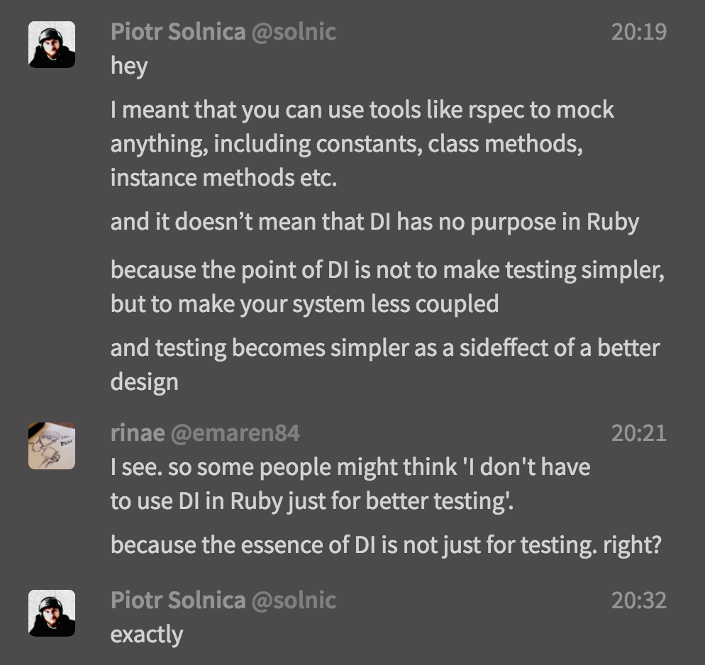

- **이 포스팅은 [Piotr Solnica](https://twitter.com/_solnic_)의 [글](http://solnic.eu/2013/12/17/the-world-needs-another-post-about-dependency-injection-in-ruby.html)을 번역한 것입니다**
- **번역 내용에 대한 조언 및 의견은 언제나 작성자에게 큰 도움이 됩니다**

---

저는 우리 루비스트들이 의존성 주입(Dependency Injection)에 대해 요즘은 어떻게 생각하는지 궁금해졌습니다. 제가 기억하는 한 의존성 주입에 대한 몇몇 토론은 대부분 자바로 인해 굳혀진 개념(post-java-trauma)을 비판하는 내용이었습니다. 이 글을 작성하기까지 오랜 시간동안 머리속으로 생각만 하고 있었지만, 이 주제가 아마도.. 알려져 있다는 것을 알고 있었습니다. 그래서 글을 작성하기 전에 구글에 검색을 해 보기로 마음먹었지요. 구글에 "ruby dependency injection"을 입력하면 이런 결과를 얻었습니다:


*역주: 이 글은 2013년 12월에 작성되었으며, 현재 같은 검색어로 검색하면 결과물의 순서 및 노출되는 글이 다릅니다.*

저는 [DHH(David Heinmeier Hansson, Ruby on Rails의 창시자)의 블로그](http://david.heinemeierhansson.com/2012/dependency-injection-is-not-a-virtue.html)로 들어가 글을 다시 읽어보았습니다. 그 글에 대해 희미한 기억만 남아있었기 때문입니다. 그리고 나서야 저는 세상이 루비의 의존성 주입에 대한 다른 글이 필요하다는 것을 깨달았습니다. 왜 그럴까요? 대개 저 글을 읽고 많은 루비스트들이 루비의 의존성 주입에 대해 잘못된 인식을 가질 우려가 있기 때문입니다. 또한 의존성 주입이 뭔지 배워보고자 하는 사람들은 DHH의 블로그 글을 발견할테고, 루비에서의 의존성 주입이 "필요 없다" 라는 크게 잘못된 생각을 가질 수 있습니다. 네, 정말로 걱정되는 부분입니다.

제가 이 글의 제목을 "루비의 의존성 주입"이라고 작성한 이유는 **"루비의"** 라는 부분이 꽤 중요하기 때문입니다. 루비의 의존성 주입은 아주 직관적인 실체를 가지고 있으며 여러가지 장점을 가지고 있습니다.

아, 간단히 정리하자면:

여러분은 루비의 의존성 주입을 사용하기 위해 어떠한 외부 라이브러리도 쓸 필요가 없습니다.

여러분은 루비의 의존성 주입을 사용하기 위해 어떠한 설정도 할 필요가 없습니다.

여러분은 루비의 의존성 주입을 사용하기 위해 코드의 단순함을 희생할 필요가 없습니다.

여러분은 루비의 의존성 주입을 사용하기 위해 코드를 더 작성해야 할 필요가 없습니다.


## 루비의 의존성 주입은 아주 쉽다

별로 대단한 건 없어요. 정말로요. 하지만 당신의 코드에 큰 영향을 줍니다. 자신만의 의존성을 갖는 객체를 만드는 것 보다 객체에 의존성을 주입 할 때 유연성은 증가하고 결합도는 낮아집니다. 더 나은 디자인을 채용하게 된 덤으로 테스트 하기도 쉬워지지요. 자주 일어나는 일입니다.

한번 살펴보시죠:

```ruby
# 일반적인 접근
class Hacker

  def initialize
    @keyboard = Keyboard.new(:layout => 'us')
  end

  # stuff
end

# 그리고 의존성 주입의 경우
class Hacker

  def initialize(keyboard)
    @keyboard = keyboard
  end

  # stuff
end
```

우리가 뭔가 멋진 의존성 주입 라이브러리를 사용했나요? 아니죠. 우리가 코드를 더 작성했나요? 글쎄요. 아니면 코드가 더 복잡해졌나요? 확실히 아닙니다.

작은 변화에 불과했지만 여러분의 코드에 **큰 영향을 미칩니다.** `Hacker` 클래스는 더 이상 키보드를 만드는 방법에 종속될 필요가 없습니다. 그저 주어진 인터페이스를 사용하게 될 뿐이며, 우리는 키보드 인터페이스를 구현하기만 하면 어떤 것이든 편하게 집어넣을 수 있게 되었습니다. 이게 유연성이 증가하고 결합도가 낮아진다는 것을 뜻합니다.

다 좋은데 그렇다면 키보드의 의존성은 어디서 만들어야 할까요? 분명 어디선가 만들어져야 할 텐데요?

제가 사용하는 패턴은 이렇습니다:

```ruby
class Hacker

  def self.build(layout = 'us')
    new(Keyboard.new(:layout => layout))
  end

  def initialize(keyboard)
    @keyboard = keyboard
  end

  # stuff
end
```

잠깐만요, 제가 코드를 더 작성하지 않아도 된다고 했나요? 제가 거짓말을 했네요. `build` 메서드를 쓰기 위해 코드를 두 줄 정도 더 써버렸습니다. 들켰네요.

그래도 일단 좋은 면만 보도록 합시다:

```ruby
# 우리는 hacker 인스턴스를 아주 작은 노력으로 만들 수 있습니다
Hacker.build('us')

# 만약 우리가 이미 키보드 객체를 가지고 있다면 이 방식으로도 작동합니다
Hacker.new(keyboard_we_already_had)
```

우리가 의존성을 명시적으로 드러냈기 때문에 테스트하기도 쉬워졌습니다:

```ruby
describe Hacker do
  # 여기서는 키보드 객체가 큰 의존성을 가지고 있어서 그냥 mock으로 만든다고 칩시다
  let(:keyboard) { mock('keyboard') }

  it 'writes awesome ruby code' do
    hacker = Hacker.new(keyboard)

    # some expectations
  end
end
```

의존성 주입이 없었다면 어떤 모양으로 보일 지 생각해봅시다. 제가 끔찍한 예를 하나 들어보겠습니다. 그리고 저는 여전히 사람들이 이런 코드를 작성하는 것을 보곤 합니다.

```ruby
describe Hacker do
  let(:keyboard) { mock('keyboard') }

  it 'writes awesome ruby code' do
	# 우웩!
    Keyboard.should_receive(:new).
      with(:layout => 'us').
      and_return(keyboard)

    hacker = Hacker.new

    # some expectations
  end
end
```

*역주: 윗부분에서 `Hacker` 클래스를 의존성 주입 없이 사용하는 예를 살펴보시면 ,`Hacker` 클래스의 인스턴스를 작성할 때 동시에 `Keyboard` 클래스의 인스턴스를 만든다는 것을 볼 수 있습니다. 그래서 `keyboard` 라는 객체가 의도대로 생성되는지를 테스트하기 위해 이런 복잡한 코드가 들어가게 되었다고 생각합니다.*


## 더 나아가서

루비의 의존성 주입을 연습할 때 저는 몇몇 작은 패턴과 규칙을 정해놓고 따르고 있습니다.

- `.new` 메서드를 깔끔하게 유지하고, 오버라이드 하지 말 것. 단순한 의존성만 인자로 받아들인다
- 빌더 메서드를 분리하여 만들고 이 메서드가 "모양빠지는" 입력들을 받아서, 해당 클래스의 객체가 필요로 하는 모든 것을 만들 수 있게한다
- 빌더 메서드가 너무 복잡해지게 되면 빌드 로직을 서로 다른 객체로 분리한다
- 생성자에 옵션 해시를 전달하는 것을 피한다

이 규칙들은 제가 작성하는 코드에 크게 긍정적인 영향을 주었습니다. 결합도를 낮추었고, 유연성을 높였으며, 리팩토링도 쉬워졌습니다.

사실 제가 이 글을 통해 작성한 간단한 예제만으로 위의 규칙이 말이 된다고 설득하는 것은 어렵습니다. 그러므로 일단 루비의 의존성 주입을 사용해보라고 권하고 싶습니다. 의존성 주입을 사용하는게 단순히 테스트할 때 이득을 보기 위해서라고 여기지 말아주세요. 제발요 :)

제가 말하고 싶은 것은 루비의 의존성 주입은 하나의 미덕이라는 점입니다. 루비는 복잡한 일들을 간단한 방법으로 구현할 수 있는 아름다운 언어입니다. 반면에 테스트 할 때 `Time.now` 에 `stub` 을 사용하는 것은 그렇게 영리한 방법은 아닙니다.*(역주: `stub` 메서드는 Rspec에서 일종의 객체 목업을 생성해주는 메서드로 알고 있습니다. 굳이 글쓴이가 `Time.now` 에 `stub` 메서드를 사용한다는 이야기를 꺼낸 것은 이 예시가 DHH의 포스트에 언급되어 있기 때문입니다.)*

물론 여러분이 루비의 의존성 주입을 사용하지 않을 수도 있지만, 실제로 사용해 보시면 더 깔끔하고 명시적인 코드를 작성하실 수 있습니다. 여러분의 코드는 더 좋아질 겁니다.


## 번역 후기

저는 언제나 기본적인 컴퓨터 과학 및 좋은 프로그래밍 방법론에 대한 지식이 부족하다는 점을 통감하고 있습니다. 단순히 전공자가 아니기 때문인 것도 있지만, 지속적으로 개발을 제대로 하려면 이러한 지식이 반드시 필요하다고 생각하고 있기 때문입니다. 이런 점에서 최근에 좀 더 알아보고 싶던 주제가 '의존성 주입' 입니다.

자바 스프링 프레임워크를 사용할 때 주로 '의존성 주입' 이라는 단어가 많이 나왔을겁니다. 그런데 제가 제대로 쓸 수 있는(정말일까?) 유일한 언어인 루비는 어떻게 의존성 주입을 사용하는지 궁금하여 찾아보다 이 글을 발견하게 되었습니다.

번역 과정 자체는 무난했는데 후반부에 "Stub Time.now" 라는 말의 뜻을 이해하지 못하겠더군요. 알고보니 두 가지 문제가 있었습니다.

1. RSpec을 제대로 써 보지 않았다
1. DHH의 글을 먼저 읽어보지 않았다

글 작성자에게 더 자세한 설명을 부탁했더니 이런 답변을 받았습니다. 참고하시기 바랍니다.



루비의 의존성 주입에 대한 이야기는 [루비로 배우는 객체지향 디자인](http://www.aladin.co.kr/shop/wproduct.aspx?ItemId=49317754) 책에도 조금 설명되어 있습니다. 루비로 프로그래밍을 하신다면 두번 이상은 읽어보시길 추천드립니다.

참고 링크:

- [주니어 개발자도 이해할 수 있는 의존성 주입](http://www.slideshare.net/hnki0104/ss-42101768)
- [Introduction to dependency injection in Ruby](https://medium.com/@Bakku1505/introduction-to-dependency-injection-in-ruby-dc238655a278#.ywoosbc3h)
- [Dependency injection is not a virtue](http://david.heinemeierhansson.com/2012/dependency-injection-is-not-a-virtue.html)

