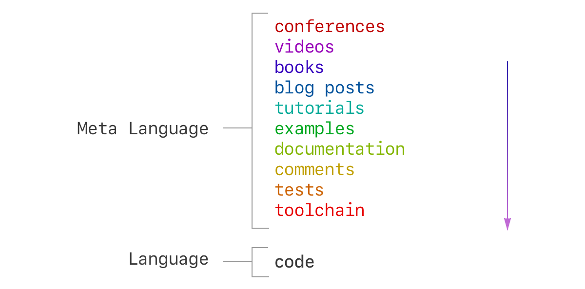

- **이 포스트는 [Alex Kotliarskyi](http://frantic.im/)의 [글](http://frantic.im/meta-language)을 번역한 것입니다.**
- **오역 지적 및 피드백은 언제나 환영합니다.**

---

저는 드디어 [Cheng Lou](https://twitter.com/_chenglou)가 ReactConf'17에서 발표한 내용을 이해했습니다. 20분정도 시간을 내실 수 있다면 이 영상을 먼저 봐 주세요.

<iframe width="560" height="315" src="https://www.youtube.com/embed/_0T5OSSzxms" frameborder="0" allowfullscreen></iframe>

**요약:** 언어가 있으면 [메타언어](https://ko.wikipedia.org/wiki/%EB%A9%94%ED%83%80_%EC%96%B8%EC%96%B4)(고차 언어)도 있다. 여기서 언어는 실제 소스 코드이고, 메타 언어는 그 위에 있는 모든 것(테스트, 주석, IDE 기능, 문서, 예제, 튜토리얼, 블로그 글, 책, 비디오, 컨퍼런스 등의 기술 발표 등)을 뜻한다. 우리는 언어를 배우기 위해 메타언어를 사용한다. 우리가 메타언어의 개념을 언어 자체로 끌어내리면, 우리가 다루는 개념은 더욱 유연해지고 점차 새로운 메타언어를 만들어나갈 수 있게 된다. 새로운 메타언어는 같은 에너지를 쏟아도 기존 메타언어에 비해 더 고차원적이고 풍부한 형태를 가질 수 있게 된다.



이 그림의 이해를 돕기 위해 다양한 예제를 준비해왔습니다.


## 어셈블리 명령어 → 변수명

우주 산업 분야에서 행성으로부터의 [탈출 속도(escape velocity)](https://ko.wikipedia.org/wiki/%ED%83%88%EC%B6%9C_%EC%86%8D%EB%8F%84)를 구하기 위해 사용되는 코드 일부를 살펴보겠습니다.

```assembly
.SUB_0_21:
    ; Computes escape velocity
    ; register xmm0 - planet mass
    ; retister xmm1 - planet radius
    mulsd   xmm0, qword ptr [rip + .LCPI0_0]
    divsd   xmm0, xmm1
    xorps   xmm1, xmm1
    sqrtsd  xmm1, xmm0
    ucomisd xmm1, xmm1
    jp      .LBB0_2
    movapd  xmm0, xmm1
    ret
.LBB0_2:
    jmp     sqrt                    ; TAILCALL
.LCPI0_0:
    .quad   4459223850755291651     ; double 1.334816E-10
```

코드의 상당수가 메타언어에 기대고 있습니다. 이 코드에 대한 주석이나 문서(여기엔 보이지 않지만) 말입니다. 위 코드와 비교해서 C로 작성된 예를 살펴보겠습니다.

```c
#define GRAVITY_CONSTANT 6.67408e-11
double escape_velocity(double mass, double radius) {
    return sqrt(2 * GRAVITY_CONSTANT * mass / radius);
}
```

그저 변수에 이름을 지정해주었을 뿐인데 메타언어에 기대고 있던 정보를 언어 자체로 끌어내릴 수 있게 됐습니다.


## 변수명 → 심화 타입(Advanced Types)

C 버전의 코드는 어셈블리로 작성된 코드보다 훨씬 많은 정보를 가지고 있고, 메타언어도 더 높은 수준으로 이루어져 있습니다. 이제 우리는 반복 작성을 하거나 코드 안의 내용이 무엇인지 문서화할 필요가 없어졌습니다. 이 함수가 2개의 인자를 받아야 하며 첫 번째 인자는 질량, 두 번째 인자는 반경이라는 내용 말입니다.

하지만 아직 문맥상 코드에 부족한 부분이 있습니다. 이 함수가 어느 단위 위에서 동작하는지 알 수가 없다는 겁니다. 당장은 라이브러리의 문서(메타언어)에 기댈 수 밖에 없습니다.

우리는 인자 이름을 `mass_kilograms`, `radius_meters` 같은 이름으로 바꾸는 간단한 트릭을 써 볼수 있지만, 언어 자체에서 '이 함수는 반드시 킬로그램과 미터를 입력해야한다'고 보장해주는 장치가 없습니다.

이제 더 복잡한 타입을 지원하는 언어의 예를 살펴보겠습니다. 저는 OCaml을 사용하겠지만 대부분의 ML-계열 언어들(하스켈, 스위프트 등)은 이런 기능을 지원합니다. ([그리고 F#은 아예 단위에 대해 가장 높은 우선 순위로 지원을 하고 있습니다.](https://docs.microsoft.com/en-us/dotnet/articles/fsharp/language-reference/units-of-measure))

```ocaml
let gravity_constant = 6.67408e-11

type mass = Kilograms of float
type length = Meters of float
type velocity = MetersPerSecond of float

let escape_velocity (Kilograms mass) (Meters radius) =
    MetersPerSecond (2.0 *. gravity_constant *. mass /. radius |> sqrt)
```

*실은 지구로부터의 탈출 속도를 계산할 때 제 구현체에서 버그를 발견했습니다. 질량을 엉뚱한 단위로 입력하고 있었어요.*

위의 코드에서 `length` 와 `mass` 는 단순한 숫자가 아니라 1급 객체(first class citizen)입니다. 덕분에 더욱 안전하고 유지보수가 용이하며 코드를 발전시키기 쉬워졌지요. 예를 들어 우리가 야드파운드법을 지원하고자 한다면(왜 그래야하는지는 모르겠지만), `mass` 타입을 이렇게 바꾸면 됩니다.

```ocaml
type mass =
  | Kilograms of float
  | Pounds of float
```

이러면 타입 체커가 기존 코드에서 새 단위를 적용하기 위해 수정해야 할 부분을 낱낱이 지적해줄 겁니다.


## 사용되지 않을 경우(Deprecation)와 다른 메타정보들

우리가 기존의 탈출 속도보다 훨씬 정확한 값을 구할 수 있는 새로운 공식을 발견했다고 칩시다. 그렇다면 기존의 함수가 더 이상 사용되지 않는다고 표시하려면 어떻게 해야할까요?

이럴 때 보통 주석이나 문서를 추가하거나 Medium에 글을 쓰는 등 메타언어를 구축할 것입니다. 하지만 메타언어로 구성된 정보들을 코드 자체로 끌어내리는게 훨씬 더 생산적인 방법입니다.

전에 썼던 트릭처럼 C 함수의 이름을 바꾸어 `escape_velocity` 를 `escape_velocity_DEPRECATED` 나 [이렇게 괴상한 이름으로 바꿀 수도 있습니다](https://github.com/facebook/react/blob/80bff5397bf854750dbe7c286f61654ea58938c5/src/umd/ReactUMDEntry.js#L21). 하지만 이는 우리의 API가 변경되면서 클라이언트의 코드가 동작하지 않게 되고, 표준적인 방법도 아닙니다(누구나 자신만의 접미사를 붙일 수 있으니까요). 그리고 새로이 사용해야 할 메서드를 제대로 추천하지 않고 있습니다.

만약 언어 자체가 이 메타정보를 알아서 알려주는 기능을 지원한다면 어떨까요?

```ocaml
let escape_velocity = ...
[@ocaml.deprecated "Please use `quantum_escape` instead"]
```


## 추가 예시

지금까지 메타적 공간에 있던 많은 정보를 언어 자체에 심어주는 하나의 방법을 보여드렸습니다. 다른 예들을 보여드리겠습니다.

**[방문자 패턴(Visitor Pattern)](https://ko.wikipedia.org/wiki/%EB%B9%84%EC%A7%80%ED%84%B0_%ED%8C%A8%ED%84%B4)과 `for` 루프 → map/filter/reduce:** 제가 대학에 다닐 땐 방문자 패턴을 배웠지만, 이젠 이 패턴이 많은 언어에서 기본 라이브러리로 손쉽게 제공되고 있습니다.

**상태(state) 불러오기:** 저는 종종 사람들이 리액트 컴포넌트를 만들면서 상태를 이렇게 설정해두는 것을 보게 됩니다.

```javascript
state = {
  data: null,
  error: null,
  loading: true,
};
```

이 경우 `loading` 이 `false` 라면 `data` 나 `error` 중에 하나가 `null` 이 되어서는 안된다는 안내를 하려면 메타언어를 사용할 수 밖에 없습니다. 그 대신 우리는 Flow나 타입스크립트(Typescript)를 사용하여 언어 단위에서 제약을 걸 수 있습니다.

```typescript
type State =
  { progress: 'loading' } |
  { progress: 'done', data: Object } |
  { progress: 'error', error: Error };
```

**리덕스(Redux)와 불변성(Immutability):** 현재는 문서, 블로그 포스트, 비디오, 컨퍼런스 발표 등에서 리덕스를 사용할 때 변수나 객체에 직접적으로 변화를 주지 않을 것을(lack of direct mutation) 전제하고 있습니다. 만약 자바스크립트가 기본적으로 불변 데이터 타입과 타입 선언(type annotations)을 제공한다면 위에서 말하는 전제를 코드에서 바로 표현할 수 있지 않을까요?

**프로미스(Promises)와 옵저버블(Observables):** 자바스크립트에서 프로미스 패턴은 라이브러리에서 제공하는 기능이었지만 이제 코어 기능으로 자리잡았습니다. [옵저버블](https://github.com/tc39/proposal-observable)에도 같은 과정이 진행중입니다.


## 결론

아무리 메타언어를 언어로 끌어내린다 하더라도 사람 사이에 의사소통하는 부분을 해결할 수는 없다는 것을 새겨두시는게 좋습니다. 하지만 언어의 진화와 함께 우리는 더 효과적인 의사소통의 기회를 열어가고 있습니다.

반드시 어딘가엔 복잡한 부분이 존재합니다. 만약 언어가 아주 단순하다면, 복잡한 부분은 메타언어에 머무르게 됩니다.

참고로  [Sebastian Markbåge의 최소한의 API 표현 범위(minimal API surface area)에 관한 발표와](https://www.youtube.com/watch?v=4anAwXYqLG8), [Jared Forsyth의 타입 시스템에 대한 발표](https://www.youtube.com/watch?v=V1po0BT7kac)를 살펴보세요. 아 그리고 영화 [컨택트(Arrival, 2016)](http://movie.daum.net/moviedb/main?movieId=105570)도 꼭 보세요. 강추합니다!

---

## 번역 후기

처음 이 글을 접하게 된 계기는 이 코드 때문이었습니다.

```javascript
// explicit
if (obj !== undefined) return obj.x;

// implicit
if (obj) return obj.x;
```

보고 계시는 자바스크립트 코드에서 위쪽에 제시된 코드가 평균적으로 최대 15%까지 처리 속도가 빠르다고 합니다. [DHH는 트위터에서](https://twitter.com/dhh/status/846627223176167424) '어차피 15%라고 해봤자 실제로는 몇 밀리초 이하일텐데 왜 기계에게 맞추려고 하느냐' 같은 내용의 비판을 쏟아내었지요. 코드를 어떻게 작성하실건지는 여러분의 취향에 맡기겠습니다.

하지만 오늘 제가 드리고픈 말씀은 아래 트윗에 다 있기 때문에 후기를 짧게 줄이고자 합니다.

<blockquote class="twitter-tweet" data-conversation="none" data-lang="en"><p lang="en" dir="ltr"><a href="https://twitter.com/dhh">@dhh</a> Code is not a conversation between a dev and a machine.&#13;&#13;Code is a conversation between a developer AND THE NEXT DEVELOPER.</p>&mdash; Don Schenck (@DonSchenck) <a href="https://twitter.com/DonSchenck/status/846675893909180416">March 28, 2017</a></blockquote>
<script async src="//platform.twitter.com/widgets.js" charset="utf-8"></script>
