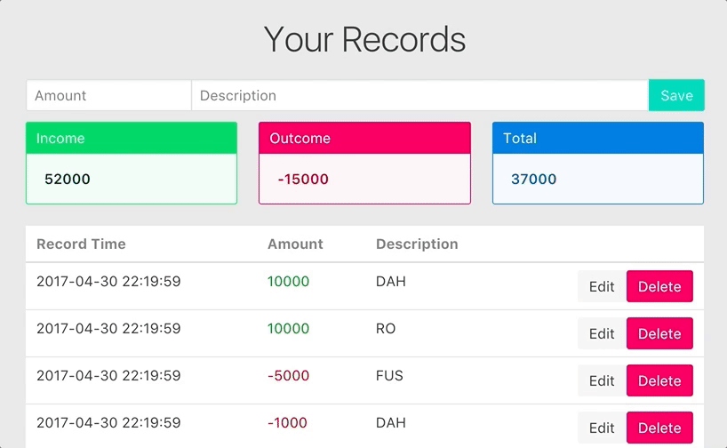
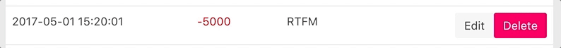

**Hanamirb + Vue.js 시리즈 목차**

1. [API 서버](/posts/hanami-vuejs-moneybook-api-server)

1. [로그인 & 회원가입 페이지](/posts/hanami-vuejs-moneybook-frontend-1)

1. [가계부 페이지](/posts/hanami-vuejs-moneybook-frontend-2)

---

로그인 페이지를 만드는데도 꽤 많은 노력이 들었지만, 기존에 사용하시던 방법으로 같은 페이지를 작성한다고 했을 때 얼마나 시간과 노력이 드는지 한번 생각해보시면 Vue.js로 구현하는 쪽이 약간 쉽지 않으셨는지요?

가계부 페이지 구현은 로그인 페이지보다 내용이 약간 길어지겠지만 여전히 그렇게 어려운 난이도는 아닙니다. 비슷한 페이지를 예전에 React로 만들어 본 적이 있었는데 지금 생각해보면 코드를 따라 쳐 봤을 뿐이지 실질적인 내용은 거의 이해가 되지 않았네요. **참고로 이 글의 내용이 이해가 잘 되지 않으시면 언제든지 질문 및 지적 부탁드립니다.**

처음에 API서버를 만들 때 구상해 두었던 요소들보다 조금 축소되긴 했지만 다음의 기능을 구현해볼 예정입니다. 혹시나 아쉽다고 느끼시는 분들은 직접 구현에 도전해보시는 것도 좋은 배움의 기회가 될 수 있겠네요.

- Amount, Description 을 입력하여 기록
- 최신 시간 순서대로 내용을 표로 출력
- Edit, Delete 버튼을 눌러서 자료의 수정 및 삭제
  - Edit 버튼을 누르면 해당 레코드의 내용이 자동으로 수정 Form으로 변화
- 모든 수익, 지출과 그 합계를 모아 상단에 대시보드 형식으로 표시

기존 방식대로 레일즈나 하나미로 웹 애플리케이션을 만들었을 때는 모든 값을 서버에서 미리 계산해두고, 랜더링된 값을 클라이언트로 전달해주면 클라이언트는 받은 페이지를 불러오는 정도의 역할을 수행했었습니다. 하지만 자바스크립트를 적극적으로 활용하면 서버에서는 레코드만 던져주고, 브라우저에서 랜더링에 필요한 값을 계산하여 출력해 줄 수 있게 됩니다.


## 페이지 틀 만들기

먼저 Vue 인스턴스와 연결할 HTML 페이지를 만들겠습니다. 파일 이름은 `content.html` 이며, 이전에 만들었던 페이지와 같은 폴더에 위치해야 합니다. 불러와야 하는 자바스크립트 라이브러리가 하나 변경된 수준입니다.

```markup
<!DOCTYPE html>
<html lang="en">
<head>
  <meta charset="UTF-8">
  <meta name="viewport" content="width=device-width, initial-scale=1.0">
  <script src="https://cdnjs.cloudflare.com/ajax/libs/axios/0.16.1/axios.min.js"></script>
  <script src="https://cdnjs.cloudflare.com/ajax/libs/vue/2.3.0/vue.js"></script>
  <script src="https://cdnjs.cloudflare.com/ajax/libs/moment.js/2.18.1/moment.min.js"></script>
  <link rel="stylesheet" href="https://cdnjs.cloudflare.com/ajax/libs/bulma/0.4.1/css/bulma.min.css">
  <link rel="stylesheet" href="https://maxcdn.bootstrapcdn.com/font-awesome/4.7.0/css/font-awesome.min.css">
  <title>MoneyBook</title>
</head>
<!-- ... -->
```

`moment` 라이브러리는 자바스크립트에서 시간을 다루는 데 필요한 최고의 라이브러리입니다. 현재 서버에 자료를 저장할 때 각 레코드의 `created_at`, `updated_at` 이 UTC 기준으로 저장되어 있는데, 서버에서 이 시간을 변경해서 보내주기보다 클라이언트에서 직접 시간대를 변경하여 알맞은 형식으로 표현하는 것 까지 처리할 것입니다.

```markup
<style>
html, body {
  height: 100%;
  padding: 0;
  margin: 0;
  background-color: #E6E6E6;
}

#app {
  height: 100%;
  margin: 1.5rem 0;
  padding: 0;
}

.title {
  text-align: center;
}

.message:not(:last-child) {
  margin-bottom: 0;
}

.message-body {
  font-weight: 600;
}

.button {
  float: right;
}

.income {
  color: green;
}

.outcome {
  color: red;
}
</style>
<body>
  <div class="columns is-mobile" id="app">
    <div class="column is-10 is-offset-1">
      <!--title-->
      <p class="title is-2 is-spaced">Your Records</p>
      <!--input form-->
      <div class="field has-addons">
        <p class="control">
          <input class="input" type="number" name="amount" placeholder="Amount">
        </p>
        <p class="control is-expanded">
          <input class="input" type="text" name="description" placeholder="Description">
        </p>
        <p class="control">
          <button class="button is-primary">Save</button>
        </p>
      </div>

      <!--dashboard-->
      <div class="columns">
        <div class="column">
          <article class="message is-success">
            <div class="message-header">
              <p>Income</p>
            </div>
            <div class="message-body">
            </div>
          </article>
        </div>
        <div class="column">
          <article class="message is-danger">
            <div class="message-header">
              <p>Outcome</p>
            </div>
            <div class="message-body">
            </div>
          </article>
        </div>
        <div class="column">
          <article class="message is-info">
            <div class="message-header">
              <p>Total</p>
            </div>
            <div class="message-body">
            </div>
          </article>
        </div>
      </div>

      <!--contents-->
      <table class="table">
        <thead>
          <tr>
            <th>Record Time</th>
            <th>Amount</th>
            <th>Description</th>
            <th></th>
          </tr>
        </thead>
        <tbody>
          <tr>
            <td></td>
            <td></td>
            <td></td>
            <td>
              <button class="button is-danger">Delete</button>
              <button class="button is-light">Edit</button>
            </td>
          </tr>
        </tbody>
      </table>
    </div>
  </div>
</body>
```

단순히 입력 태그가 맨 윗쪽에 있고, 대시보드, 테이블 순으로 자료가 표시되는 구조입니다. 이 안에 어떻게 내용을 채워나가게 될 지 기대해주세요.


## 인증 및 자료 가져오기

지난번 로그인 페이지를 만들 때 로그인이 성공하면 JWT 토큰을 저장하고, 이 `content.html` 페이지로 이동하도록 만들어 두었습니다. 그러면 당연하게도 `content.html` 페이지를 이용할 수 있는 사람은 유효한 토큰을 가지고 있는 사람이어야 합니다.

페이지가 처음 랜더링 될 때 무언가 행동을 지시하려면 Vue 인스턴스에 `created` 를 지정하면 됩니다. Vue 인스턴스의 라이프사이클을 더 자세히 보시려면 [다음 가이드](https://kr.vuejs.org/v2/guide/instance.html#라이프사이클-다이어그램)를 참고해주세요.

```javascript
const app = new Vue({
  el: '#app',
  data: {
    records: [],
  },
  created() {
    let token = localStorage.getItem('auth_token');
    if (!token) {
      location.href = './login.html';
    }
    this.fetchData(token);
  },
  // ...
});
```

인스턴스가 만들어질 때 토큰을 가져오고, 만약 해당 토큰이 없다고 하면 로그인 페이지로 되돌립니다. `fetchData` 는 바로 아래에 구현할 메서드인데, 여기서도 만약 유효하지 않은 토큰이라고 판명되면 로그인 페이지로 되돌립니다.

```javascript
// ...
methods: {
  fetchData(token) {
    axios({
      method: 'get',
      url: 'http://localhost:2300/api/records',
      headers: { 'Authorization': `Bearer ${token}` }
    })
    .then(response => {
      this.records = response.data.records;
    })
    .catch(error => {
      if (error.ersponse.status === 401) {
        localStorage.removeItem('auth_token');
        location.href = './login.html';
      }
      // handle error
    });
  }
}
// ...
```

토큰이 있다면 `fetchData` 메서드로 토큰을 실어 서버에 요청을 보내게 됩니다. 이미 API 서버를 만들 때 유효하지 않은 토큰이라면 401에러를 리턴하도록 만들어두었기 때문에, 그냥 로그인 페이지로 돌려버리면 됩니다. 만에 하나 다른 에러가 출력된다면 여러분들이 편한 방법대로 에러를 다루면 될 것입니다.

잘 작동하는지 테스트하실 때는 하나미 API 서버를 미리 켜두시는 것을 잊지 마시기 바랍니다.

```
bundle exec hanami server
```

당장은 저장된 자료가 없기 때문에 POSTMAN으로 일일이 요청을 보내어 자료를 생성할 수 밖에 없을겁니다. 그냥 하나미 콘솔에서 임의의 자료를 몇 개 생성해두록 하겠습니다.

```
bundle exec hanami console
-------------------------
[2] pry(main)> 15.times do
[2] pry(main)*   RecordRepository.new.create(
[2] pry(main)*     user_id: 5, // Your favorite user id
[2] pry(main)*     amount: [-1000, -5000, 5000, 1000, 10000].sample,
[2] pry(main)*     description: %w(FUS RO DAH).sample
[2] pry(main)*   )
[2] pry(main)* end
```

이제 랜더링 된 후에 브라우저 콘솔에서 `app.records` 명령어를 입력해보시면 가져온 자료들이 배열로 표시됩니다.


## 대시보드 표시하기

대시보드에 쓰일 자료를 자바스크립트로 계산하여 표시해주는 작업은 `computed` 속성에 정의해두면 됩니다. `data` 들을 다루어 계산된 결과를 리턴해주고, 만약 값의 변화가 있다면 바로 반영됩니다.

```javascript
const app = new Vue({
  // ...
  computed: {
    sumOfIncome() {
      return this.records.filter(record => {
        return record.amount > 0;
      }).reduce((sum, income) => {
        return sum + income.amount;
      }, 0);
    },

    sumOfOutcome() {
      return this.records.filter(record => {
        return record.amount < 0;
      }).reduce((sum, outcome) => {
        return sum + outcome.amount;
      }, 0);
    },

    totalAmount() {
      return this.records.reduce((sum, record) => {
        return sum + record.amount;
      }, 0);
    },
  },
  // ...
});
```

수입과 지출을 표시해주는 함수는 `records` 배열에서 각각 0보다 크거나 작은 수를 추린 뒤에 모든 수를 합치고, 전체 합계를 표시해주는 함수는 그냥 더해주기만 하면 됩니다. `filter`, `map` 등에 바로 이어 `reduce` 를 활용해주는 방법은 여러모로 유용하게 사용할 수 있습니다.

이 계산된 값을 바로 HTML 태그 안에 `{{ }}` 로 감싸주어 입력해주시면 됩니다.

```markup
<!--dashboard-->
<div class="columns">
  <div class="column">
    <article class="message is-success">
      <div class="message-header">
        <p>Income</p>
      </div>
      <div class="message-body">
        {{ sumOfIncome }}
      </div>
    </article>
  </div>
  <div class="column">
    <article class="message is-danger">
      <div class="message-header">
        <p>Outcome</p>
      </div>
      <div class="message-body">
        {{ sumOfOutcome }}
      </div>
    </article>
  </div>
  <div class="column">
    <article class="message is-info">
      <div class="message-header">
        <p>Total</p>
      </div>
      <div class="message-body">
        {{ totalAmount }}
      </div>
    </article>
  </div>
</div>
```


## 전체 자료 표로 표시하기

API 서버에 요청하여 가져온 자료를 바로 쓰는데는 몇 가지 문제가 있습니다.

1. 오래된 자료가 먼저 나옵니다. 보통은 최신 순서로 정렬을 하게 되지요.
2. 시간 표시가 UTC인데다가, 바로 표시하기 어려운 형식으로 나옵니다.

그러면 우리는 자료 표시 순서를 뒤집어주고, 시간 표시를 더 깔끔하게 해 주면 되겠네요. 여기서도 `computed` 를 활용합니다.

```javascript
// ...
computed: {
  allRecords() {
    return this.records.reverse().map(record => {
      let createdAt = record.created_at.replace(/\sUTC$/, '');
      let localCreatedAt = moment.utc(createdAt).local().format('YYYY-MM-DD HH:mm:ss');

      return {
        id: record.id,
        amount: record.amount,
        description: record.description,
        created_at: localCreatedAt
      }
    });
  },
// ...
```

`records` 배열의 순서를 뒤집어주고, 시간대를 다시 지정한 뒤에 원하는 포맷으로 출력하도록 만들었습니다. 이렇게 변환된 배열을 `v-for` 로 반복 출력해주면 됩니다.

```markup
<!--contents-->
<table class="table">
  <thead>
    <tr>
      <th>Record Time</th>
      <th>Amount</th>
      <th>Description</th>
      <th></th>
    </tr>
  </thead>
  <tbody>
    <template v-for="record in allRecords">
      <tr>
        <td>{{ record.created_at }}</td>
        <td :class="{
          income: record.amount > 0,
          outcome: record.amount < 0
        }">
          {{ record.amount }}
        </td>
        <td>{{ record.description }}</td>
        <td>
          <button class="button is-danger">Delete</button>
          <button class="button is-light">Edit</button>
        </td>
      </tr>
    </template>
  </tbody>
</table>
```

파이썬의 `for..in` 문법과 비슷하게 생각하시면 됩니다*(이 사람은 파이썬을 써 본적이 없다)*. `allRecords` 배열에 있는 각각의 `record` 를 사용하여 템플릿을 랜더링하게 됩니다.

한 가지 살펴보실 점은 수입과 지출을 구분하기 위해 사용한 `:class` 입니다. `v-bind:class` 와 같은 의미인데, 해당 HTML 속성을 Vue 인스턴스와 묶어둔다는 의미입니다. 자세한 내용은 [가이드](https://kr.vuejs.org/v2/guide/class-and-style.html)를 참고하시기 바랍니다.

보통은 `data`, `computed` 에 객체를 정의해두고 `:class` 로 불러와서 해당 객체의 값이 true이면 표시하고, false이면 표시하지 않는 형태로 되어있는데, 반복문에서는 어떻게 활용해야할지 잘 몰라서 저렇게 직접 입력했습니다. 레코드의 값이 0 이상이면 income 클래스가 활성화되고, 0 이하이면 outcome 클래스가 활성화됩니다.

여기까지 하셨다면 절반은 오신겁니다. 나머지는 자료의 입력, 수정 및 삭제를 구현하면 됩니다.





## 지출 및 수입 기록하기

지난번 로그인 Form과 같은 형태로 Form이라는 클래스를 따로 만들겠습니다. 클래스 내부는 이전에 로그인 페이지 만들었던 때와 거의 동일합니다.

```javascript
class Form {
  constructor(data) {
    this.originalData = data;

    for (let field in data) {
      this[field] = data[field];
    }
  }

  data() {
    let data = {};

    for (let field in this.originalData) {
      data[field] = this[field];
    }
    return data;
  }

  create() {
    let data = { record: this.data() };
    let token = localStorage.getItem('auth_token');
    axios({
      method: 'post',
      url: 'http://localhost:2300/api/records',
      data: data,
      headers: { 'Authorization': `Bearer ${token}` }
    })
    .then(response => {
      app.records.push(response.data);
    })
    .catch(error => {
      // handle errors
    });
  }
}

const app = new Vue({
  el: '#app',

  data:{
    records: [],
    insertForm: new Form({
      amount: '',
      description: ''
    })
  }
  // ...
});
```

`create` 메서드가 호출될 때 저장되어있던 토큰을 가져와서 요청할 때 헤더에 실어보내게 됩니다. 요청이 성공했을 때 돌아온 데이터는 우리가 레코드 저장용으로 지정해두었던 `records` 배열에다 추가해주면 됩니다. (혹시나 해서 말씀드리지만 `app.records` 는 아래부분에 만들어놓은 Vue 인스턴스의 `this.records` 와 같은 의미입니다.) 그 다음에 배열에 변화를 감지한 뷰 인스턴스는 `computed` 에 지정해두었던 `allRecords` 의 계산을 다시 하게 됩니다. 변경을 감지하는 배열 메서드 및 그 활용법은 [가이드](https://kr.vuejs.org/v2/guide/list.html#배열-변경-감지)를 참고하시기 바랍니다.

나머지는 저장 버튼을 누를 때 `Form#create` 함수가 실행되도록 만들면 됩니다.

```markup
<!--input form-->
<div class="field has-addons">
  <p class="control">
    <input class="input" type="number" v-model="insertForm.amount" placeholder="Amount">
  </p>
  <p class="control is-expanded">
    <input class="input" type="text" v-model="insertForm.description" placeholder="Description">
  </p>
  <p class="control">
    <button class="button is-primary" @click="insertRecord">Save</button>
  </p>
</div>
```

```javascript
const app = new Vue({
  // ...
  methods: {
    // ...
    insertRecord() {
      this.insertForm.create();
    }
  },
  // ...
});
```


## 기록 변경하기

너무나 당연하겠지만 우리가 작성한 기록은 수정할 수 있어야합니다. Edit 버튼을 누르면 기존의 자료가 표시되던 테이블 행이 Input 폼으로 변하게 만들 예정입니다.



여기까지 튜토리얼을 진행해보셨다면 Amount, Description 표시 부분에 `v-if`, `v-else` 를 이용하면 되지 않을까? 하고 생각하실 수 있을겁니다. 지금처럼 작은 규모의 프로젝트에는 매 `td` 태그마다 조건에 따라 레이아웃이 변하게 만드는 일이 그렇게 어렵지 않지요. 그런데 너무 줄이 길어져서 가독성도 떨어지고, 아예 `tr` 태그의 레이아웃이 통채로 달라지게 만들 예정이라면? 그럴 땐 컴포넌트를 도입하면 됩니다.


### 컴포넌트 추출하기

리액트를 조금이라도 해 보셨던 분이라면 아시겠지만, 리액트는 JSX로 DOM을 생성하고, 계층화된 컴포넌트의 조합으로 하나의 앱을 만드는게 가능합니다. Vue.js도 컴포넌트를 지원합니다. 보통은 노드 프로젝트로 Vue 프로젝트를 만들 때 많이 쓰게 되는데, 일반적인 자바스크립트에도 충분히 컴포넌트를 만들 수 있습니다.

HTML 부분에 너무 코드가 많아지면 가독성이 떨어진다고 생각하고, 앞으로 한 부분에서 두 개의 컴포넌트가 나오도록 만들 예정이기 때문에 지금 사용자 레코드를 보여주는 부분을 컴포넌트로 분리해보겠습니다. 우리가 `v-for` 문 바로 아래에 만들었던 `tr` 태그 부분을 통채로 복사하시면 됩니다.

`Form` 클래스 바로 아래에 새로운 변수를 선언합니다.

```javascript
const RecordRow = {
  props: ['record'],
  template: `
    <tr>
      <td>{{ record.created_at }}</td>
      <td :class="{
        income: record.amount > 0,
        outcome: record.amount < 0
      }">
        {{ record.amount }}
      </td>
      <td>{{ record.description }}</td>
      <td>
        <button class="button is-danger">Delete</button>
        <button class="button is-light">Edit</button>
      </td>
    </tr>
  `
};
```

`template` 속성은 이 컴포넌트가 어떤 형태의 HTML 태그를 가지고 있는지 나타냅니다. 그리고 `props` 는 부모 컴포넌트에서 자식 컴포넌트로 내려보내는 속성입니다. 여기서는 기존에 쓰던대로 `record` 를 속성으로 가져왔고, 이 속성을 그대로 활용하고 있습니다.

컴포넌트를 만들었으면 사용할 수 있도록 장착하고, HTML 파일에 선언해주어야 합니다. 먼저 Vue 인스턴스에 `components` 속성을 정의합니다.

```javascript
const app = new Vue({
  // ...
  components: {
    'record-row': RecordRow
  }
});
```

이제 우리는 HTML 파일에 `record-row` 라는 이름으로 태그를 선언하여 컴포넌트를 사용할 수 있습니다.

```markup
<template v-for="record in allRecords">
  <record-row :record="record"></record-row>
</template>
```

`:record` 는 `v-bind:record` 의 약어입니다. 해당 속성을 이렇게 컴포넌트에 지정해주면 컴포넌트에서 `record` 라는 이름의 속성을 사용할 수 있는겁니다. 다른 이름을 사용하고자 하면 `:somethingElse` 같이 다른 이름을 넣고, 컴포넌트의 `props` 속성에도 다른 이름을 넣어주고 사용하시면 됩니다. 아직까지 이 컴포넌트는 기존에 HTML에 작성해둔 코드와 똑같은 일을 수행합니다.


### Edit 버튼으로 토글하기

일단 Edit 버튼을 누르면 테이블 행 자체가 바뀌도록 만드는 기능부터 구현해보겠습니다. 토글 버튼을 누르면서 일어나는 과정을 순서대로 나열해보자면 다음과 같습니다.

1. 토글 버튼 클릭
2. 해당 행의 자료가 '수정 가능한 상태(isEditMode or isEditable)' 로 변경
3. 변경된 자료를 배열에 반영
4. 배열이 수정되면서 변경된 부분만 Vue.js 가 알아서 새로 랜더링

우리가 처음에 `records` 배열을 만들 당시에는 수정 가능한 상태를 표시하는 속성이 없었으니 이 속성을 먼저 추가하겠습니다.

```javascript
// Vue instance
computed: {
  allRecords() {
    // ...
    return {
      id: record.id,
      amount: record.amount,
      description: record.description,
      created_at: localCreatedAt,
      isEditMode: record.isEditMode
    }
  }
},
// ...
methods: {
  fetchData(token) {
    // ...
    .then(response => {
      this.records = response.data.records.map(record => {
        return Object.assgin(record, { isEditMode: false });
      });
    })
    // ...
  }
}
```

처음에 `fetchData` 메서드로 레코드를 가져올 때 각 레코드마다 `isEditMode` 속성을 추가하면서 초기값으로 `false` 를 넣어주었습니다. 그리고 `allRecords` 는 `records` 배열에 따라 값을 가져오니까 그대로 값을 가져오면 됩니다. 나중에 `isEditMode` 속성이 `true` 로 변하게 되면 `allRecords` 는 자동으로 새로운 배열을 만들어낼겁니다.

기본적으로 상위 컴포넌트와 하위 컴포넌트는 Props를 통한 단방향 데이터 흐름을 형성합니다. 물론 다양한 방법으로 양방향으로 데이터 변경을 가하는 방법은 있습니다. 하지만 이 경우에는 신중을 기하여 설계하셔야 합니다. 자칫 앱의 규모가 커지면서 상태 관리가 겉잡을 수 없이 복잡해질 수 있으니까요.

그럼 우리는 어떻게 하위 컴포넌트에 있는 Edit 버튼을 클릭하여 상태를 변경할 수 있을까요? 이 때는 [사용자 지정 이벤트](https://kr.vuejs.org/v2/guide/components.html#사용자-정의-이벤트)를 활용하여 하위 컴포넌트에 특정 이벤트가 일어났다고 상위 컴포넌트에 알리고, 그에 따라 상위 컴포넌트가 연산을 수행하도록 만들면 됩니다.

```javascript
const RecordRow = {
  props: ['record'],
  template: `
	// ...
      <td>
        <button class="button is-danger">Delete</button>
        <button class="button is-light" @click="toggleEdit">Edit</button>
      </td>
    </tr>
  `,
  methods: {
    toggleEdit() {
      this.$emit('toggle-edit');
    }
  }
};
```

`toggle-edit` 은 상위 컴포넌트에서 `record-row` 컴포넌트를 선언할 때 이벤트로 지정해두면 됩니다. **이벤트 이름이 일치하지 않는다고 오류가 따로 나지 않기 때문에 오탈자에 유의하셔야 합니다.**

```markup
<template v-for="(record, index) in allRecords">
  <tr>
    <record-row v-if="!record.isEditMode" @toggle-edit="toggleEditModeOf(index)" :record="record"></record-row>
    <div v-else>Hello! Edit Mode Toggled!</div>
  </tr>
</template>
```

`v-for` 는 이렇게 각 배열의 요소 뿐 아니라 인덱스도 가져올 수 있습니다. Vue 인스턴스에서 `toggle-edit` 이벤트가 일어났다고 감지하면 `toggleEditModeOf` 메서드를 실행하게 만들면 됩니다.

```javascript
// Vue instance
methods: {
  // ...
  toggleEditModeOf(index) {
    let target_record = this.records[index];
    this.records.splice(index, 1,
		Object.assign(target_record, {
      		isEditMode: !target_record.isEditMode
	    }));
  }
}
```

`Array#splice` 메서드로 해당 인덱스에 있는 자료의 상태를 변경해줍니다. Vue.js는 이 변화를 감지하여 `allRecords` 의 변경된 부분만 새로 만듭니다.


### 수정용 컴포넌트 만들기

이제 토글 버튼을 눌러서 원하는 줄의 내용이 바뀌는걸 확인하셨다면  `v-else` 위치에 새로운 컴포넌트가 들어가게 만들면 됩니다. 수정용 컴포넌트는 조금 더 복잡합니다. 왜냐면 Edit 버튼을 눌렀을 때 원래 적혀있던 값이 input 태그로 바뀌면서 그대로 유지되어야 하며, 변경된 값을 서버에 전송하기 전에 처리해두어야 하기 때문입니다.

1. updateForm이라는 새로운 Form 객체를 생성
2. Edit 버튼이 토글 될 때 updateForm은 기존 레코드의 자료를 복사해서 저장
3. 수정용 컴포넌트에서 변경값이 입력될 때 updateForm의 속성도 같이 변화
4. Update 버튼을 누르면 입력된 정보를 서버로 전송

```javascript
const UpdateRow = {
  props: ['record', 'form'],
  template: `
    <tr>
      <td>{{ record.created_at }}</td>
      <td>
        <input class="input" type="number" :value="record.amount"
               @input="updateFormValue('amount', $event.target.value)" />
      </td>
      <td>
        <input class="input" type="text" :value="record.description"
               @input="updateFormValue('description', $event.target.value)" />
      </td>
      <td>
        <button class="button is-danger" @click="toggleEdit">Cancel</button>
        <button class="button is-light" @click="updateRecord">Update</button>
      </td>
    </tr>
  `,
  computed: {
    editForm() {
      let form = this.form;
      for (let field in this.record) {
        form[field] = this.record[field];
      }
      return form;
    }
  },
  methods: {
    toggleEdit() {
      this.$emit('toggle-edit');
    },
    updateFormValue(field, value) {
      this.editForm[field] = value;
      this.$emit('form-update', this.editForm);
    },
    updateRecord() {
      this.$emit('update-record');
    }
  }
};

// ..
const app = new Vue({
  el: '#app',
  data: {
    // ...
    updateForm: new Form({
      id: '',
      amount: '',
      description: ''
    })
  },
  methods: {
    // ...
    updateRecord() {
      this.updateForm.update();
    }
  }
  // ...
  components: {
    'record-row': RecordRow,
    'update-row': UpdateRow
  }
});
```

코드 아래 쪽을 먼저 봐주시면 `updateForm` 객체를 만들어두긴 했지만 아직 빈 값밖에 없는 상태입니다. 그래서 `editForm` 을 이용하여 컴포넌트에서 `record` 의 값을 updateForm(여기서는 form) 으로 복사해주는 작업을 합니다. 다음에는 input 이벤트가 일어날 때마다 해당 값을 반영한 뒤에 변경된 `form` 을 부모 컴포넌트로 올려보냅니다.

```markup
<template v-for="(record, index) in allRecords">
  <record-row v-if="!record.isEditMode"
    @toggle-edit="toggleEditModeOf(index)"
    :record="record"></record-row>
  <update-row v-else
    @toggle-edit="toggleEditModeOf(index)"
    :record="record" :form="updateForm"
    @form-update="form => { updateForm = form }"
              // 여기서 form은 아까 컴포넌트에 있던 this.editForm 입니다
    @update-record="updateRecord"></update-row>
</template>
```

`form-update` 이벤트 리스너는 자식 컴포넌트가 올려준 `form` 을 기존에 만들어두었던 `updateForm` 과 바꿔치기하게 되지요. 분명 더 좋은 방법은 있습니다만, 저와 이 글을 보시는 여러분 모두 차근차근 보면서 더 나은 방법으로 구현할 수 있게 되었으면 좋겠습니다.


### 서버에 전송하기

Update 버튼을 누르면 `updateRecord` 가 실행되게 만드는 것 까지 하셨다면 Form 클래스에 `update` 메서드를 구현하면 됩니다. 기존에 하던 방법처럼 axios로 요청을 보내고 그 응답을 처리하시면 됩니다.

```javascript
class Form {
  // ...
  update() {
    let record_id = this.id;
    let data = { record: this.data() };
    let token = localStorage.getItem('auth_token');
    axios({
      method: 'patch',
      url: `http://localhost:2300/api/records/${record_id}`,
      data: data,
      headers: { 'Authorization': `Bearer ${token}` }
    }).then(response => {
      let index = app.records.findIndex(record => {
        return record.id === response.data.id;
      });
      app.records.splice(index, 1, response.data);
    })
    .catch(error => {
      // handle error
    })
  }
}
```


## 레코드 삭제하기

마지막 기능인 레코드 삭제를 구현하겠습니다. 여지껏 구현해왔던 기능에 비하면 훨씬 쉽게 구현할 수 있습니다. 삭제 버튼을 클릭하면 '이 기록을 삭제할것이다' 라는 이벤트를 전송하고, 그러면 우리는 레코드 삭제용 메서드에 해당 레코드의 인덱스를 넘겨주면 됩니다.

```markup
<record-row v-if="!record.isEditMode"
  @toggle-edit="toggleEditModeOf(index)"
  @delete-record="deleteRecord(index)" // delete-record 추가
  :record="record"></record-row>
```

```javascript
const RecordRow = {
  // ...
  template: `
	// ...
    <td>
      <button class="button is-danger" @click="deleteRecord">Delete</button>
      <button class="button is-light" @click="toggleEdit">Edit</button>
    </td>
  `,
  // ...
  methods: {
    toggleEdit() {
      this.$emit('toggle-edit');
    },
    deleteRecord() {
      this.$emit('delete-record');
    }
  }
}

// ...
const app = new Vue({
  // ...
  methods: {
    // ...
    deleteRecord(index) {
      let record_id = this.records[index].id;
      let token = localStorage.getItem('auth_token');

      axios({
        method: 'delete',
        url: `http://localhost:2300/api/records/${record_id}`,
        headers: { 'Authorization': `Bearer ${token}` }
      })
      .then(response => {
        this.records.splice(index, 1);
      })
      .catch(error => {
        console.log(error.response.data);
      });
    }
  }
  // ...
});
```

여담이지만 서버와 통신하는 메서드는 어느정도 일관된 틀을 가지고 있다는 점을 보실 수 있습니다. 토큰을 가져와야 하고, 비슷한 URL로 요청을 보내며, 응답에 따라 `response` / `error` 를 받아옵니다. 이 기본 기능을 이해하시면 서버 통신하는 기능을 재사용 가능한 함수로 만들어서 불필요한 코드가 반복되는 일을 줄일 수 있을겁니다.

------

이렇게 간단한 가계부 앱을 HTML 페이지 두 장으로 만들어보았습니다. 강좌에서 제공한 코드 곳곳에 개선해야 할 점들은 많습니다. 바로 위에 말씀드렸다시피 중복되는 기능을 재사용 가능하게 만든다던가, 자료를 처리하는 방법을 조금 더 효율적으로 만들거나, 에러를 처리를 위한 고민도 필요합니다.

코드를 찬찬히 살펴보시면서 '이렇게 하면 더 나을거같은데..' 라고 생각하는 부분을 직접 구현해보시면서 점차 Vue.js의 사용법을 익혀나갈 수 있으리라 생각합니다. [공식 가이드만 참고하셔도](https://kr.vuejs.org/v2/guide/) 충분히 괜찮은 퀄리티의 앱을 만드실 수 있을겁니다.

- Source Code: [Github](https://github.com/emaren84/moneybook_client)
