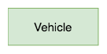
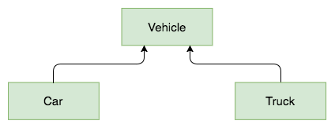
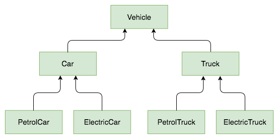
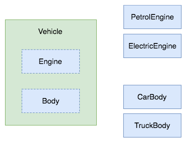

- 이 글의 원문은 [Michał Konarski](http://mjk.space/how-to-avoid-inheritance-in-ruby/)가 작성하였습니다.
- 번역 실수 및 용어 사용의 지적 등은 언제나 환영합니다.

---

상속이 왜 문제가 될까요? 예를 하나 들어드리겠습니다.

여러분의 고객이 '교통 상황 시뮬레이터'를 만들어달라고 요청했다고 해보죠. 고객은 몇몇 자동차가 움직이는 모습을 실험해보고 싶어합니다. 만약 루비같은 객체지향 언어를 사용한다면 먼저 모든 로직과 속성을
 담고 있는 모델 클래스를 떠올리게 됩니다. 이렇게요.



완성된 결과물을 고객에게 보여주었습니다. 다 괜찮았는데 이제 고객이 자동차가 '승용차' 혹은 '트럭' 으로 나뉘었으면 좋겠다고 합니다. 이런 경우 두 차종은 최소한 일부 행동을 공유하고 있있는데다, 코드를 반복해서 작성하는 것도 별로 내키지 않습니다. 문제 없어요! 상속을 활용하면 되죠! 지금 마주친 경우는 아주 적절한 '-이다(is-a)' 관계입니다. 안 될 것 있나요?



고객은 결과물에 또 만족했지만, 또 다른 추가사항을 요구했습니다. 이 자동차들이 다른 종류의 엔진을 탑재했으면 한다고 합니다. 예를 들어 석유 엔진과 전기 엔진으로요. 다시 한번 상속을 사용해서 문제를 해결해보겠습니다!



여러분의 고객은 '지금은' 아주 행복합니다. 하지만 또 세분화를 요구한다면 어떻게 될까요? 전용차라던가, 경찰차라던가, 소방트럭이나 앰뷸런스 등 이보다 더 많은 세분화를 요구한다면? 우리의 상속 트리는 점점 커지고 복잡해지게 됩니다. 반복되는 코드를 줄이는 대신에 결국 같은 로직을 여러군데 복사-붙여넣기 하게 될 것입니다. 심지어 [위키피디아에도](https://en.wikipedia.org/wiki/Combinatorial_explosion) 이 현상이 기재되어 있습니다.

위에서 말씀드린 사례는 제가 가볍게 지어낸 경우가 아닙니다. 저는 전문 개발자로 일하면서 오래된 코드에 새로운 기능이나 행동을 추가하려 할 때마다 이런 상황을 여러 번 접했습니다. 특히 여러분이 레일즈를 사용하면서 더 자주 접하실
 수 있습니다. `ApplicationRecord` 나 `ApplicationController` 를 상속하도록 강제하는 경우가 많기 때문입니다.

상속이 발생하는 코드를 예로 보여드리겠습니다.

``` ruby
class Vehicle
  def run
    refill
    load
  end
end

class Car < Vehicle
  def load
    # 승객을 싣는다
  end
end

class Truck < Vehicle
  def load
    # 화물을 싣는다
  end
end

class PetrolCar < Car
  def refill
    # 연료를 채운다
  end
end

class ElectricCar < Car
  def refill
    # 전지를 충전한다
  end
end

class PetrolTruck < Truck
  def refill
    # 연료를 채운다 (반복되는 코드!)
  end
end

class ElectricTruck < Truck
  def refill
    # 전지를 충전한다 (반복되는 코드!)
  end
end
```

이 코드를 더 낫게 만들 수 있을까요? 가능합니다.


## 아마도 믹스인(Mixin)을 쓰면?

수 많은 루비 프로그래머들이 상속이 문제를 해결할 수 없다고 깨닫는 순간, 가장 먼저 떠오르는 해결책은 믹스인일 겁니다. 믹스인이 뭘까요? 기본적으로 메서드들이 정의된 모듈을 클래스에 포함하여 그 클래스의 일부로 사용하는 기법입니다. 우리는 간단히 공통된 로직을 추출하여 코드의 재사용을 피할 수 있습니다. 

믹스인을 사용하면 코드가 어떻게 바뀔까요? 먼저 `include` 하게 될 모듈을 만들겠습니다.

```ruby
module Vehicle
  def run
    refill
    load
  end
end

module Truck
  def load
    # 화물을 싣는다
  end
end

module Car
  def load
    # 승객을 싣는다
  end
end

module ElectricEngine
  def refill
    # 전지를 충전한다
  end
end

module PetrolEngine
  def refill
    # 연료를 채운다
  end
end
```

그리고 믹스인할 대상이 되는 클래스를 만듭니다.

```ruby
class PetrolCar
  include Vehicle
  include Car
  include PetrolEngine
end

class ElectricCar
  include Vehicle
  include Car
  include ElectricEngine
end

class PetrolTruck
  include Vehicle
  include Truck
  include PetrolEngine
end

class ElectricTruck
  include Vehicle
  include Truck
  include ElectricEngine
end
```

좀 보기 좋습니다. 코드가 반복되지도 않았고, 새로운 종류의 특성을 넣어서 어떤 종류의 차량이라도 만들어낼 수 있게 되었습니다. 게다가 차량이 어떤 기능을 가지고 있는지도 눈에 잘 들어옵니다.

하지만 여전히 문제가 남아있습니다. 클래스를 살펴보면 포함된 행동들이 어떻게 사용되는지 명확하지 않습니다. 믹스인으로 새로운 메서드들이 추가되었지만 이 메서드들이 무엇을 하는지, 클래스가 어떻게 메서드와 영향을 주고받는지, 실행되는 과정은 어떻게 되는지 바로 파악할 수 없습니다. 만에 하나 같은 이름을 가지고 있는 두 모듈을 가져와 사용한다면 문제가 발생하게 됩니다. 한 모듈이 다른 모듈에 있는 메서드를 '조용히' 가져와서 사용하게 되겠지요. 상속 할 클래스가 늘어나면서 생기는 문제와 비슷한 방식으로 코드가 엉망이 되기 시작합니다.

믹스인은 확실히 좋은 사용처가 있기 때문에 그렇게 나쁜 방법은 아닙니다. 제 의견으로는 로깅, 인증, 유효성 검사 등 클래스의
 메타행위(meta behavior)를 정의할 때는 아주 잘 동작한다고 생각합니다. 믹스인은 코드를 깔끔하고 작은 규모로 유지할 수 있다는 명확한 장점이 있습니다. 여러분이 모듈에 정의되어 있는 구현을 믿고 있고, 서로 다른 로직을 무너뜨리지 않는 지점을 파악하고 있는 한 괜찮습니다. 기억하셔야 할 점은 이는 단지 **루비가 은연중에 다중 상속을 구현하는 방법**에 불과하다는 점입니다.

<blockquote class="twitter-tweet" data-lang="en"><p lang="en" dir="ltr">In OOP there’s this thing to prefer composition over inheritance. And in Ruby people constantly forget that modules == multiple inheritance</p>&mdash; Piotr Solnica (@_solnic_) <a href="https://twitter.com/_solnic_/status/623224611212251136">July 20, 2015</a></blockquote>
<script async src="//platform.twitter.com/widgets.js" charset="utf-8"></script>

이 문제를 개선할 수 있을까요? Yes, we can!


## 조합

조합은 저도 오래전에 알고 있었지만 최근에야 사용하기 시작한 용어입니다. 단지 조합을 충분히 편하게 사용할만큼 좋다는 *느낌을 받지 못했습니다.* 그러던 어느 날 Sandi Metz의 ['Nothing is Something'](https://www.youtube.com/watch?v=OMPfEXIlTVE) 이라는 아주 환상적인 발표를 보게 되었습니다. 다른 것 보다 그녀는 조합에 대해 이야기하면서 제가 예를 들었던 문제(교통 상황 시뮬레이터)를 풀어냈습니다.

조합은 어떤 방식으로 동작할까요? 클래스 사이에 **같은** 행위를 공유하려 하기보다, 어떤 요소가 **다른**지 알아낸 뒤에 이름을 붙이고, 개별 클래스로 추출해낸 뒤에 마지막에 하나의 객체로 합치는 방식으로  동작하게 됩니다.

상속이 '-이다(is-a)' 관계를 나타낸다면 조합은 '-를 가지고 있다(has-a)' 관계를 나타냅니다. 그러므로 조합을 활용하기 위해서 문제의 구조를 바꾸어야 합니다. 우리의 차량은 더 이상 전기자동차가 아니라, 전기 엔진을 가진 자동차 입니다(Our vehicle **is not** an electric vehicle anymore but rather it **has** an electric engine). 트럭은 그냥 트럭이 아니고 자동차가 트럭의 몸체를 가진 것입니다(It **is not** a truck but it **has** a truck body). 이렇게 우리는 두 가지 개념을 잡아냈습니다. 바로 **엔진** 과 **몸체** 입니다.

우리의 애플리케이션은 이제 아래와 같은 모습이 되었습니다. 엔진과 몸체 컨셉을 구현한 뒤에 `Vehicle` 클래스 안에 엔진과 몸체가 들어갈 자리를 마련했습니다.



실제 코드는 어떻게 될까요? 핵심 클래스부터 살펴보겠습니다.

```ruby
class Vehicle
  def initialize(engine:, body:)
    @engine = engine
    @body = body
  end

  def run
    @engine.refill
    @body.load
  end
end
```

이제 우리는 컨셉에 맞는 구현을 한 뒤에 `Vehicle` 객체에 주입하면 됩니다.

```ruby
class ElectricEngine
  def refill
    # 전지를 충전한다
  end
end

class PetrolEngine
  def refill
    # 연료를 채운다
  end
end

class TruckBody
  def load
    # 화물을 싣는다
  end
end

class CarBody
  def load
    # 승객을 싣는다
  end
end
```

마지막으로 모두 한 곳에 넣으면 됩니다.

```ruby
petrol_car = Vehicle.new(engine: PetrolEngine.new, body: CarBody.new)
electric_car = Vehicle.new(engine: ElectricEngine.new, body: CarBody.new)
petrol_truck = Vehicle.new(engine: PetrolEngine.new, body: TruckBody.new)
electric_truck = Vehicle.new(engine: ElectricEngine.new, body: TruckBody.new)
```

이 접근방식은 많은 이점이 있습니다. `Vehicle` 클래스가 외부 로직을 사용하는 방식은 첫 눈에 명확하게 들어옵니다. 이름이 꼬이는 문제도 없습니다. 각각의 클래스는 정확히 한 가지 일을 하고 있습니다([단일 책임 원칙](https://ko.wikipedia.org/wiki/%EB%8B%A8%EC%9D%BC_%EC%B1%85%EC%9E%84_%EC%9B%90%EC%B9%99)을 만족합니다). 그래서 이 클래스들이 자신에게 주어진 일을 얼마나 제대로 하는지 확인하는 테스트를 쉽게 할 수 있습니다.

우리는 높은 응집력(관련있는 로직을 같이 두는 것)을 달성하면서 동시에 결합도(클래스의 의존성을 낮게 만드는 것)는 낮추었습니다. 이제 인터페이스 전체를 바꾸지 않는 한, 고객의 요구에 걱정하지 않고 코드에 사용되는 엔진이나 몸체를 바꿀 수 있습니다.

조합 기법에도 문제점이 있을까요? 물론 있습니다. 이 방식은 코드를 더 길게 쓰도록 합니다. 특히 모든 의존성들을 최종 객체에 주입하게 될 때 눈에 띄게 길어집니다. 여러분은 추가적인 보일러플레이트(여기서는 코드를 생산해내는 템플릿 함수)를 만들어서 참조 위치를 저장하고, 어디에 위임을 할지 설정하며 정확한 실행 흐름을 제어할 수 있도록 만들어야 합니다. 문제의 처방전으로 여러분은 여러 가지 [제작 패턴](https://en.wikipedia.org/wiki/Creational_pattern)을 활용할 수 있습니다. 팩토리(Factory)나 빌더(Builder) 처럼요.

제가 조합을 활용하려고 할 때 제일 어려웠던 점은 제 사고 방식을 조합을 응용하기에 알맞는 방식으로 고치는 것이었습니다. 예상밖으로 **Go** 언어를 가지고 놀 때 많은 도움을 받았습니다. 이 프로그래밍 언어는 상속을 받지 않도록 설계되어 있지만 객체지향 방식으로 코드를 작성할 수 있게 되어있습니다. 또한 프로그래머들에게 조합을 사용하도록 권장하는 기능들이 담겨있습니다. (역주: [이 글](http://hackthology.com/object-oriented-inheritance-in-go.html)이 Go 언어에서 조합을 사용하는 예를 보여주는 좋은 글로 보입니다) 제가 Go를 조금 가지고 놀다가 갑자기 조합을 사용하는데 훨씬 익숙해졌다는 사실을 깨달았습니다. 다음 포스팅에 이 이야기를 자세히 쓰고자 합니다.


## 결론

저는 여러분께 코드를 구축하는 세 가지 다른 접근 방식을 보여드렸습니다. 상속, 믹스인, 조합 말씀입니다. **상속**은 많은 프로그래머들의 첫 번째 선택지이지만, 저에게는 심하게 과용되고 코드를 복잡하게 만드는데다 유지보수도 힘들게 만들었습니다. **믹스인**은 더 똑똑하고 강력한 대체제로 보이지만 사실은 다중 상속의 한 방법에 불과하고 코드의 복잡도를 늘릴 수도 있습니다. **조합**은 코드 양은 제일 길어지겠지만 클래스 사이에 의존성을 관리하는데 가장 직관적이며 깔끔한 접근방식을 가지고 있습니다. 조합은 코드를 작고 분리된 조각으로 유지하며 테스트하기도 쉽습니다. 그래서 제가 가장 선호하는 방법입니다.

객체 지향 프로그래밍은 일부 프로그래머들이 다른 프로그래머들이 처한 문제를 조금 더 쉽게 해결하도록 돕고자 만든 하나의 협약에 지나지 않는다는 점을 잊으시면 안됩니다. 규약에 얽매이지 마세요. 여러분이 처한 상황에 가장 잘 맞는 해결책을 선택하세요.

그리고 마지막으로, 이 말을 새겨두시기 바랍니다.

> 객체 지향 소프트웨어를 설계하는 일은 어렵다. 그리고 재사용 가능한 객체 지향 소프트웨어를 설계하는 일은 훨씬 더 어렵다. - Gang of Four

이 말을 경험을 통해 알게 되실 겁니다.


## 원문의 참고 자료

- RailsConf 2015 - Nothing is Something
- https://learnrubythehardway.org/book/ex44.html
- https://robots.thoughtbot.com/reusable-oo-inheritance
- https://www.thoughtworks.com/insights/blog/composition-vs-inheritance-how-choose

---

## 번역 후기

어느정도 일상과 공부와 번역 등의 밸런스가 틀이 잡혀가면서 한달에 한 개 정도 포스팅하는 방향으로 굳어지고 있나봅니다. 적어도 한달에 두어개는 작성하고 싶은데.. 좋은 글은 매일 탐독하고 있지만 제대로 써먹지 못하면서 알려봤자 뭐가 좋나? 라는 생각이 들 때도 있습니다.

이전에 의존성 주입에 관한 글을 번역했을 때도 그렇지만 조합 패턴은 루비를 사용하면서, 혹은 자바스크립트를 사용하면서도 아주 중요한 패턴 중 하나라고 생각합니다. 반드시 자유자재로 다루고 싶은 패턴이긴 한데 '평범하게' 레일즈를 사용하게 되면 아마 쉽게 익숙해지긴 힘든 패턴이라 생각합니다. 그래서 개인적으로 루비로 API 백엔드를 구축하는 토이 프로젝트를 하시게 된다면 하나미(hanamirb)를 이용해서 만들어보시는걸 강력하게 권장하고 싶습니다. 레일즈는 구조 특성상 이런 형태의 조합을 사용하기 쉽지 않다고 생각하기 때문입니다. (`ActiveSupport::Concern`, `Single Inheritance Table` 등)

자바스크립트에서 조합을 사용하는 것을 권장하는 글도 최근에 읽고 큰 감명을 받았는데, 한번 살펴보시길 권하면서 링크를 남깁니다.

- https://developers.caffeina.com/object-composition-patterns-in-javascript-4853898bb9d0
- https://medium.com/javascript-scene/the-two-pillars-of-javascript-ee6f3281e7f3